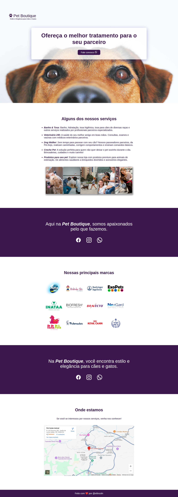

# 🐾 Pet Boutique

A proposta deste projeto é desenvolver um site elegante para uma pet shop fictícia, utilizando HTML e CSS. O site oferece uma visão clara dos serviços, marcas parceiras, localização e contato.

---

## 🧠 Conceitos Trabalhados

- Estruturação semântica com HTML5
- Estilização com CSS
- Inclusão de mapa via iframe
- Organização de conteúdo por seções

---

## 🔍 Preview do Projeto Completo

---

## 🧱 Tecnologias Utilizadas

- **HTML5**
- **CSS3**

---

## 📄 Licença

Este projeto está licenciado sob a MIT License.
Você pode usar, modificar e distribuir como quiser. É um projeto feito para fins de estudo.
